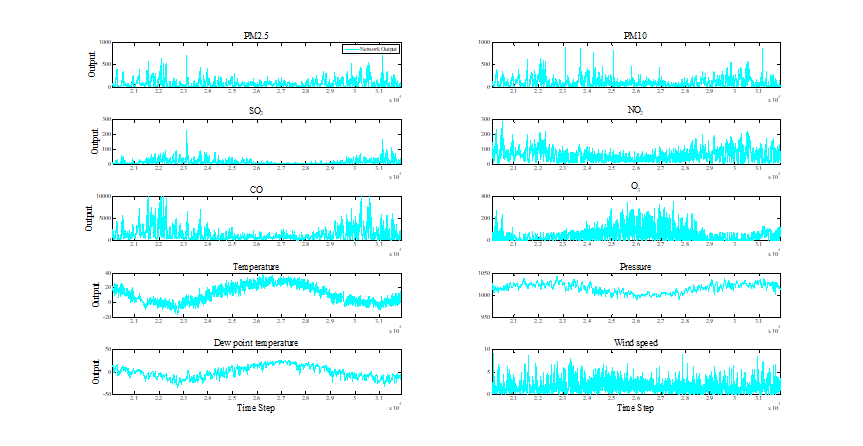

# 城市空气质量预测（ PM 2.5 NO CO）

近年来，随着中国经济社会的不断发展以及工业化、城市化进程的加快，大气污染问题也愈发严重。大气污染物主要包括一氧化碳(CO)、二氧化硫(SO~2~ )、氮氧化物(NO~X~ )、臭氧(O~3~)等气体污染物以及可吸入颗粒物(PM10)、细颗粒物(PM2.5)等颗粒态污染物，空气质量对人类的生产、生活具有直接的重要影响，甚至会诱发一系列健康安全问题。因此，建立科学合理的空气质量预测模型，提升空气质量监测预警能力，具有十分重要的现实意义。

本课题以2013年3月至2017年2月北京市环境监测点每小时的空气质量数据为例进行空气质量预测，该数据集共31876个样本，每个样本涵盖了监测点每小时的PM2.5、PM10、SO~2~、NO~2~、CO、O~3~的浓度值以及温度、压力、露点温度、风速的监测值。

**任务说明：**

1、将原始的空气质量数据进行合理划分，确定训练集、测试集

2、确定合适的循环神经网络结构和参数构建空气质量数据的多元序列预测模型

3、使用设计的循环神经网络进行空气质量的多元序列预测

**推荐采用方法：**

1、神经网络结构的确定：可以采用RNN神经网络结构

2、根据训练集、测试集的结果进行网络参数的调整

3、尝试采用不同模型、不同参数、不同步长下的网络结构完成实验结果的对比分析

4、对比不同循环神经网络方法的预测性能，如LSTM、GRU等

**评分细则：**

1、设计完成一类基于循环神经网络的空气质量预测模型（60分）。

2、不同空气质量预测模型的文献归纳，方法实现等工作（20分）。

3、不同循环神经网络模型在空气质量预测方面的性能比对（20分）。

**考核方式：**

1、完整程序测试、附源程序

2、结果讨论说明

3、改进与展望
